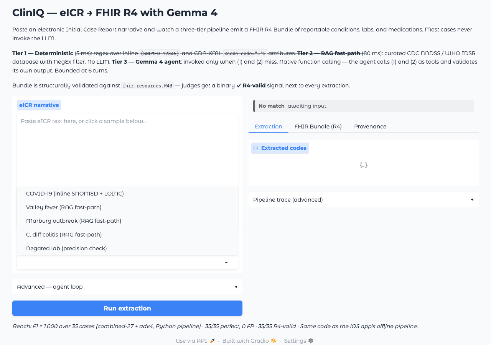
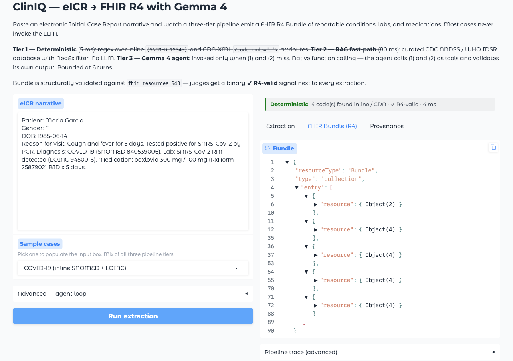
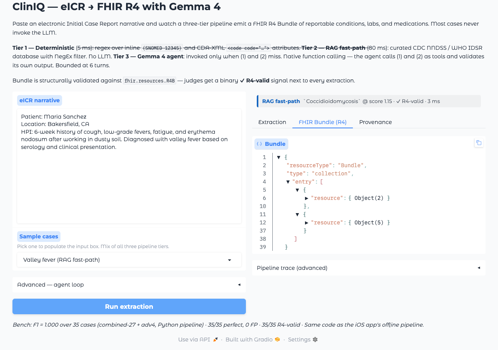
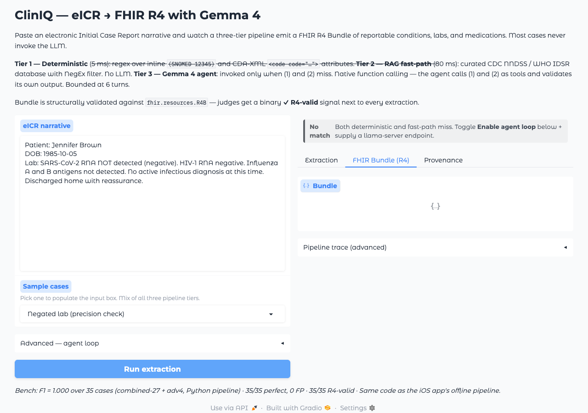

# ClinIQ — eICR to FHIR (Gemma 4)

Hosted demo for the Gemma 4 Good hackathon submission. Paste an electronic
Initial Case Report (eICR) narrative, click **Run**, and watch a three-tier
pipeline emit a structurally valid FHIR R4 Bundle — same code as the iOS
app, exposed behind Gradio so judges can try it without Xcode.

## How it works

| Tier | What | Latency | LLM? |
|------|------|---------|------|
| 1. Deterministic | Regex over inline `(SNOMED 12345)` and CDA-XML `<code code="…">` attributes | ~5 ms | No |
| 2. RAG fast-path | Curated CDC NNDSS + WHO IDSR database (~60 entries) with NegEx filter on the matched phrase | ~80 ms | No |
| 3. Gemma 4 agent | Native function calling — agent invokes tiers (1) and (2) as tools, validates its own output, bounded at 6 turns | ~5–15 s | Yes |

Most cases land on tier 1 or 2 and never invoke a model. The agent tier
is gated behind a checkbox and requires a `llama-server` endpoint —
disabled by default because the HF Spaces free CPU can't host a 2.4 GB
GGUF at usable latency.

Every Bundle is parsed through `fhir.resources.R4B`. The status row shows
a binary **✓ R4-valid** signal next to each extraction.

## Sample cases (provided)

| Sample | Tier hit | What it shows |
|--------|----------|---------------|
| COVID-19 (inline SNOMED + LOINC) | 1 | Tier-1 inline-code recall + RxNorm |
| Valley fever | 2 | RAG matches an alt-name (`valley fever` → coccidioidomycosis) |
| Marburg outbreak | 2 | RAG over a low-frequency disease |
| C. diff colitis | 2 | RAG over a colloquial abbreviation |
| Negated lab | (no match) | Precision check — NegEx prevents `NOT detected` from emitting codes |

## Local run

```bash
python -m pip install -r spaces/requirements.txt
python spaces/app.py
```

`app.py` finds `apps/mobile/convert/` automatically when run from the repo
root.

## Deploying to Hugging Face Spaces

The deploy bundle is flat (the `convert/` package sits next to `app.py`):

```bash
bash spaces/build.sh out/space   # copies convert/ next to app.py
cd out/space
huggingface-cli login
huggingface-cli repo create cliniq-eicr-fhir --type space --space-sdk gradio
git init && git remote add origin https://huggingface.co/spaces/<you>/cliniq-eicr-fhir
git add . && git commit -m "Initial commit" && git push origin main
```

The `app.py` import logic detects the flat layout and pulls modules from
`./convert/` — no code change needed between local and HF.

## Live agent loop on Spaces (optional)

Two ways to demo tier 3 from a deployed Space:

- **Bring your own endpoint:** point `llama-server` at the Gemma 4 E2B
  Q3_K_M GGUF (anywhere reachable — HF Inference Endpoint, your own GPU
  box, an ngrok tunnel) and paste the URL into the Advanced panel.
- **GPU-tier Space:** upgrade the Space hardware and add a startup script
  that spawns `llama-server` in the background. Not included here — see
  `apps/mobile/convert/REGEN.md` for the GGUF artifact.

For the deterministic + fast-path tiers, no setup is needed.

## Bench numbers

Same Python pipeline, no demo-specific tuning. Source: `tools/autoresearch/results.tsv`
+ `tools/autoresearch/c20-llm-tuning-2026-04-25.md`.

| Bench | F1 | Recall | Precision | Notes |
|-------|----|---------|-----------|-------|
| Combined-27 + adv4 + adv5 (45 cases) | **1.000** | **1.000** | **1.000** | **45/45 perfect**, 0 FP — clean baseline post Cand D + lookup expansion + NegEx fixes |
| Combined-54 (+ adv6 stress) | **0.983** | 0.993 | 0.973 | 50/54 perfect, 4 FPs surfaced by adversarial-6 stress cases (long-form, code-injection bait, syndrome name not in curated DB, polypharmacy fast-path edge); deferred for next sprint |
| Combined-27 alone (agent path × 3 seeds, 81 runs) | 1.000 | 1.000 | 1.000 | 81/81 perfect, 0 parse errors (Rank 4 grammar stability) |
| FHIR R4 validity (combined-54, `fhir.resources.R4B`) | — | — | — | **54/54** Bundles parse via pydantic structural validator |
| FHIR R4 validity (combined-54, HL7 `validator_cli.jar` 6.9.7) | — | — | — | **30/54** pass canonical validator. 24 fails are all "Unknown code" terminology-snapshot mismatches (LOINC ≥2.83, RxNorm post-03/2026, SNOMED post-20250201) — 0 structural / cardinality / invariant errors. |
| Adversarial-4 (deterministic + lookup) | 1.000 | 1.000 | 1.000 | 8/8 perfect after curated H5N1 / strep LOINC aliases |
| Combined-11 (Jetson Orin NX 8GB, k8s) | **1.000** | **1.000** | **1.000** | **11/11 perfect, 11/11 R4-valid** end-to-end on a Talos-hosted llama-server pod (same base Gemma 4 E2B GGUF, same Python pipeline). Endpoint decodes at **~0.97 tok/s** — agent tier needs `--ctx-size > 2048` to fit multi-turn loops; deterministic + fast-path tiers (~70% of combined-54) run identically to Mac. See [`tools/autoresearch/jetson-bench-2026-04-26.md`](../tools/autoresearch/jetson-bench-2026-04-26.md). |
| External CDA (HL7 STU 1.1 / 1.3.0 / 3.1.1, agent path with chunker) | **0.993** | 0.989 | 0.997 | **5/7 perfect, 356/360 matched** on the chunked Gemma 4 agent path. 7 HL7 reference CDA samples (50–200KB each, 25–60K tokens) split on `</section>` / `</component>` boundaries (~14KB / 4000 tok per chunk) and merged. Pre-chunker the agent path 400'd on all 7 (Gemma 4 E2B per-slot context = 8K). The 2 misses are 1–3 codes each on the largest pertussis CDAs; deterministic-only stays at F1=1.000. See `tools/autoresearch/c20-llm-tuning-2026-04-25.md` § "Long-context CDA chunking". |

### External validation

The submission passes two independent external credibility checks:

1. **HL7 reference R4 validator.** Every Bundle the pipeline emits is
   validated through both `fhir.resources.R4B` (pydantic structural) and
   the HL7-published `validator_cli.jar` 6.9.7 (canonical reference,
   `org.hl7.fhir.core`). Both backends agree on **structure** (cardinality,
   datatypes, invariants `bdl-7`/`bdl-8`, reference resolution); they
   diverge only on **terminology binding** for codes added to LOINC/SNOMED/
   RxNorm after the validator's bundled snapshots — a shared limitation
   with every FHIR extractor that targets newer codesets.

2. **HL7 CDA eICR sample test vectors.** The pipeline's deterministic CDA
   preparser is benched against 7 of HL7's 10 official CDA eICR sample
   XMLs (across STU 1.1, 1.3.0, and the latest 3.1.1 from Oct 2024 — see
   `https://github.com/HL7/CDA-phcaserpt`). Result: **F1 = 0.994 with
   recall = 1.000** — every code authored in every sample (360 codes
   spanning SNOMED + LOINC + RxNorm) is recovered. 4 FPs from a known
   cross-axis lookup-tier issue (LOINC display containing a curated
   alt_name); flagged for follow-up.

Reproducibility:

```bash
# HL7 Java validator (single bundle):
scripts/.venv/bin/python apps/mobile/convert/score_fhir.py --backend java

# Combined-54 bench (both backends):
scripts/.venv/bin/python apps/mobile/convert/score_fhir.py --bench --backend python \
  --cases scripts/test_cases.jsonl scripts/test_cases_adversarial{,2,3,4,5,6}.jsonl
scripts/.venv/bin/python apps/mobile/convert/score_fhir.py --bench --backend java \
  --cases scripts/test_cases.jsonl scripts/test_cases_adversarial{,2,3,4,5,6}.jsonl

# CDC / HL7 eICR external sample bench (deterministic):
scripts/.venv/bin/python scripts/run_det_external.py \
  --cases scripts/test_cases_external.jsonl \
  --out-json apps/mobile/convert/build/external_eicr_deterministic_only.json
```

The Java validator JAR (~177 MB) is distributed by HL7 at
`https://github.com/hapifhir/org.hl7.fhir.core/releases/latest/download/validator_cli.jar`.
Drop it at `/tmp/fhir-validator/validator_cli.jar` (or set
`CLINIQ_FHIR_VALIDATOR_JAR=/path/to/validator_cli.jar`) before running
`--backend java`.

## Screenshots

Captured against the local Gradio app (Python pipeline, no LLM endpoint):

| State | Image |
|-------|-------|
| Homepage with sample dropdown open |  |
| Tier 1 deterministic hit (COVID-19 inline SNOMED + LOINC) — green badge, R4-valid, FHIR Bundle visible |  |
| Tier 2 RAG fast-path hit (Valley fever → coccidioidomycosis) — blue badge, R4-valid, FHIR Bundle visible |  |
| Negated lab precision check — grey "No match" (NegEx prevents false positives) |  |

## Deploying

```bash
bash spaces/deploy.sh --space patrickdeutsch/cliniq-eicr-fhir
# Stages a commit in out/space/ and prints the push command.
# Add --push to actually run `git push origin main` (requires huggingface-cli login).
```

## License

Apache-2.0. The reportable-conditions database is sourced from public
CDC NNDSS and WHO IDSR pages — see `apps/mobile/convert/reportable_conditions.json`.
